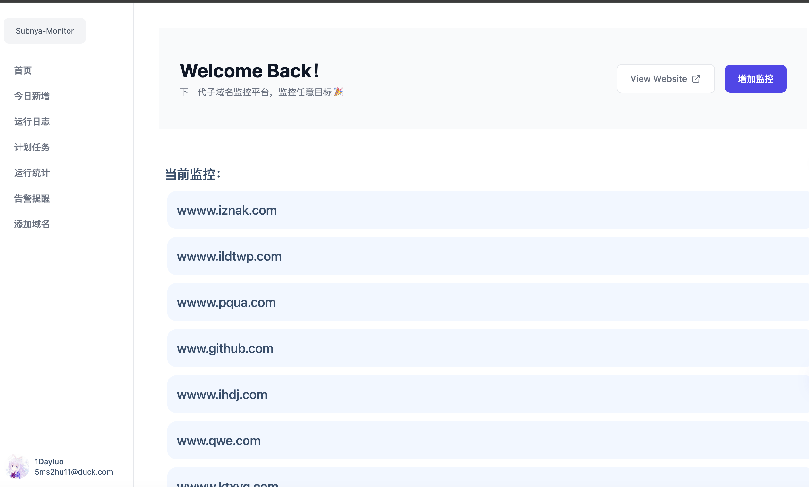

# Subnya-Monitor
基于subnya的可视化子域名监控平台   
项目正在开发中……


## 开发环境启动
flask
```
gunicorn run:app
```


celery
```
celery -A run.celery_app worker
```

frontend
```
npm run serve
```

## TODO
-  基本功能
-  Dockerfile部署